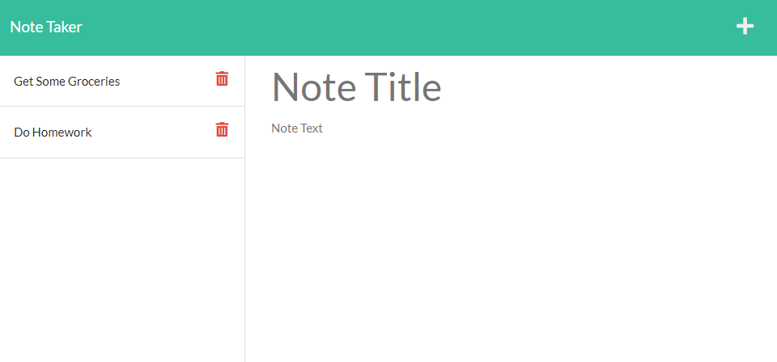

# Note Taker

## Table Of Contents 
- [description](#note-taker)
- [usage](#usage)
- [technologies](#Technologies)
- [license](#license)

## Description
As a user, I want to have an app to record my daily notes, and need to review them by title and delete them if needed.

## Usage
This app is using REST routes to achieve such objectives, by editing a JSON file.

Deployed Application:
https://banbanleelee.github.io/noteTaker/

## Technologies 
* HTML
* CSS
* JavaScript
* Bootstrap
* Node.js
* npm
* Express.js
* Nodemon

## License
This application is covererd under MIT.

